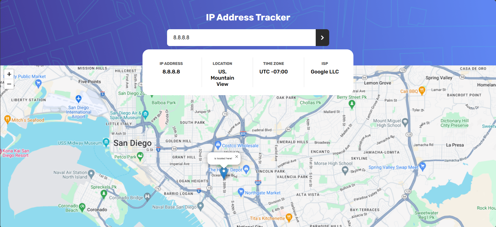
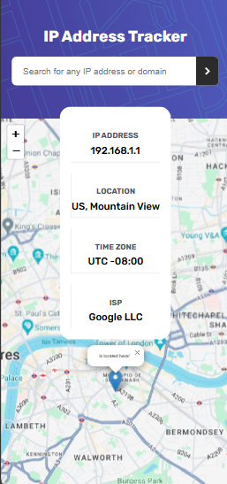

<h1 align="center" id="title">IP Tracker project</h1>

This is a project for the search for information based on an ip, including the map of the location of the ip with library angular

<h2>Project Screenshots:</h2>

<h2>🛠️ Installation Steps:</h2>

1. Clone project

git clone https://github.com/cesarvargasL/IP-Tracker.git

2. install

npm install 

3. Run project

ng serve

<h2>💻 Built with</h2>

Technologies used in the project:

* TypeScript
* HTML
* CSS
* Node v14.20.1
* Angular 12

<h2>👾 Development:</h2>

This project is developed by
* César Vargas
